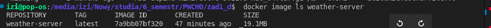

# Instrukcja użycia kontenera `weather-server`

## a. Budowanie obrazu kontenera

Aby zbudować obraz kontenera na podstawie przygotowanego projektu, wykonaj poniższe polecenia:

```bash
cd zad1_d
docker build -t weather-server .
```


## b. uruchomienia kontenera na podstawie zbudowanego obrazu
```bash
docker run -p 8081:8081 weather-server
```


## c. sposobu uzyskania informacji z logów, które wygenerowałą opracowana aplikacja podczas uruchamiana kontenera (patrz: punkt 1a),
    logi pokazują się na tej samej stronie internetowej co informacje o pogodzie


## d. sprawdzenia, ile warstw posiada zbudowany obraz oraz jaki jest rozmiar obrazu.
```bash
    docker history weather-server
    docker image ls weather-server
```



